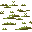

# Tiles

In order to render anything on the map, you will need data about each world tile. For that, you will need a .tile file and at least one sprite for it.

```json
{
	"name":"grass",
	"framePaths":["Sprites/grass.png"],
	"framesPerSecond":1,
	"openDirections":15
}
```
Example grass sprite used for tile: 

=== Name
Is used to identify the tile from .map files.
=== Frames
``framePaths`` will list each sprite in the animation from the root of the mod folder.

FPS can be set for if your using multiple frames, but is unused for a single frame.
=== Open Directions
Allow leaving and entering only for certain directions.

To calculate how many open directions your tile will have, add up the numbers representing each direction you want to be passable.

- Up = 1
- Down = 2
- Left = 4
- Right = 8

For example all directions is 15, only left or right would be 12, and none would be 0.
===